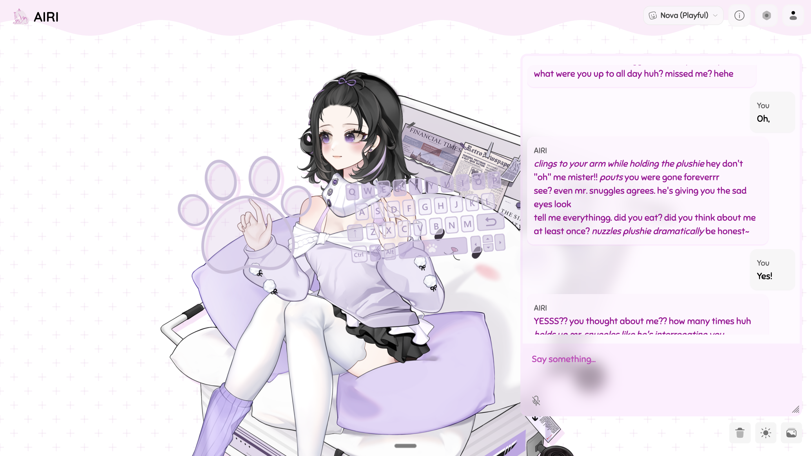

# AIRI Nova — Customized Fork



A customized fork of [AIRI](https://github.com/moeru-ai/airi) with personality-driven Live2D companion features, built for self-hosting on a Hetzner server via Tailscale.

This build is specifically made for the [bear Pajama Extended Version](https://kyoki.booth.pm/items/6333409) Live2D model by kyokiStudio. The model isn't redistributed here — grab it from booth.pm and import it; see [Setup](#setup).

## What's Changed

### Live2D Expressions & Items
- Emotion expression mapping for the bear Pajama model (happy, sad, angry, surprised, curious, awkward)
- Item/accessory toggle system — the model can pick up and put down glasses, hat, plushie, game controller, coat, sweater, earphones, snacks, and more
- Emotions and items are triggered by the LLM using special tokens (`<|ACT|>` and `<|ITEM|>`)

### Voice & Speech
- TTS text filtering — action descriptions wrapped in `*asterisks*` or `<action>` tags are stripped before speech synthesis
- ElevenLabs voice settings (stability, similarity boost, speed) now persist correctly across page visits
- Voice settings no longer revert to defaults when testing in the playground

### Speech Recognition
- VAD (Voice Activity Detection) tuned for natural conversation — longer silence threshold before cutoff, less aggressive exit detection
- Microphone permission auto-request on page load so device selection works immediately

### Config Sync
- Merge-based sync server — multiple browsers can share settings without overwriting each other
- Cards merge by ID (union), other settings use per-key timestamps (newer wins)
- Per-key change tracking via `localStorage.setItem` interception
- Position and scale excluded from sync (device-specific)

### Memory & Tools
- Long-term memory layer — PGlite + pgvector with local `Xenova/all-MiniLM-L6-v2` embeddings (no external embedding API)
- Self-authored memory tools so Nova manages her own recall: `remember_about_user`, `correct_memory`, `forget_about_user` (single-purpose by design — DeepSeek calls specific tools reliably, generic ones poorly)
- Provenance-tracked writes (`self` vs `user_confirmed`), non-destructive dedup, and soft-delete on forget so misfires are cheap and reversible
- Automatic recall: relevant memories are retrieved and injected into context, gated by a tuned MiniLM cosine relevance floor to avoid noise
- Memories also save themselves automatically from conversation, not just on explicit request
- Editable memory curation page at `GET /api/memory/admin` — view, add, and delete what Nova remembers
- Tool bridge with additional agent tools: `web_search`, plus `knowledge_search` / `knowledge_read` over a personal notes folder (`KNOWLEDGE_ROOT`)

### Self-Hosting
- `serve-unified.py` — serves the SPA and proxies API, ElevenLabs, sync, and unspeech endpoints
- `sync-server.py` — lightweight config sync with merge logic
- Server auth requirements made optional for local/self-hosted setups

## Setup

### Prerequisites
- A Linux server (this runs on Hetzner)
- [Tailscale](https://tailscale.com/) installed on both the server and your device
- Node.js and pnpm

### Installation

1. Clone and install dependencies:
   ```bash
   git clone https://github.com/Nitro05glycerin/AIRI-Nova.git
   cd AIRI-Nova
   npx pnpm install
   ```

2. Build the frontend:
   ```bash
   npx pnpm build:web
   ```

3. Start the servers:
   ```bash
   python3 sync-server.py &
   python3 serve-unified.py 3030 &
   ```

### Importing the Live2D Model

The model is not included in this repo. Purchase/download the [bear Pajama Extended Version](https://kyoki.booth.pm/items/6333409) zip from booth.pm.

1. Open AIRI in your browser
2. Go to **Settings > Display Model**
3. Import the `bear_Pajama_Extended_Version.zip` you downloaded from booth.pm
4. Select the bear Pajama model

### Accessing AIRI

1. Make sure Tailscale is installed and running on your device
2. Connect to the same Tailscale network as the Hetzner server
3. Open `https://<your-server>.<your-tailnet>.ts.net:8443/` in your browser

## Credits

- Based on [AIRI](https://github.com/moeru-ai/airi) by Moeru AI
- Live2D model: [bear Pajama Extended Version](https://kyoki.booth.pm/items/6333409) by kyokiStudio
- Customizations by Nitro, with assistance from Claude
